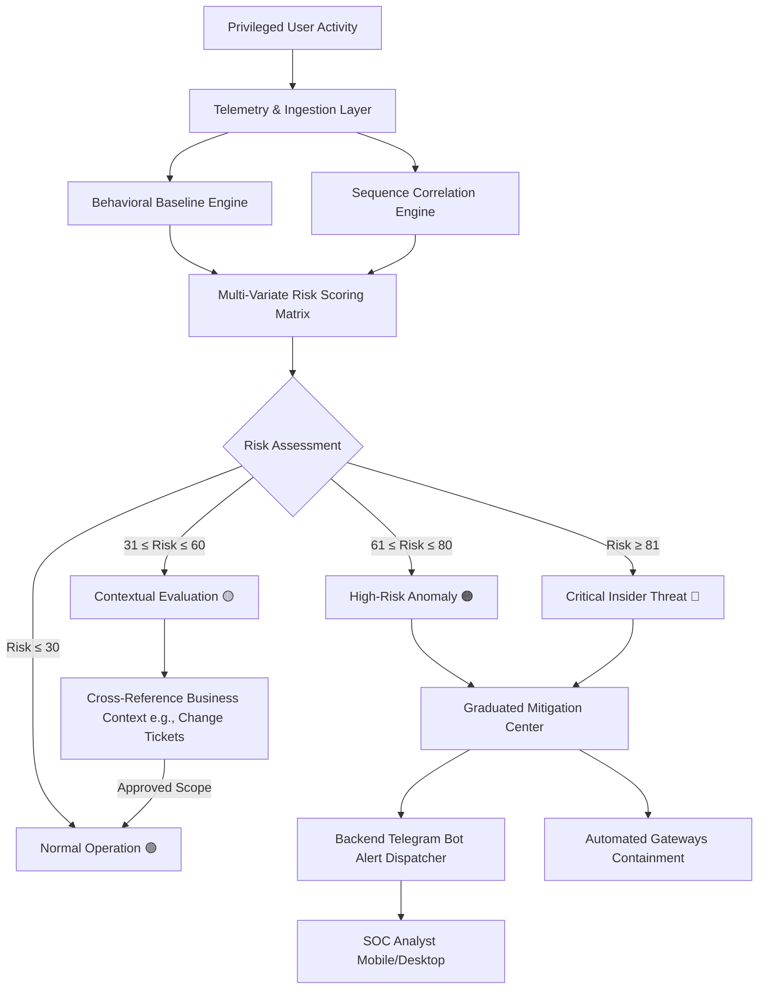

# 🛡️ SENTINEL — Privileged Behaviour Intelligence

> **CSI ORIGIN 2026 — Problem Statement 9: Privileged Access Misuse & Insider Threat Detection**  
> *"Authorised Access ≠ Authorised Behaviour"*

---

## 📌 Executive Summary

Traditional Privileged Access Management (PAM) and Identity & Access Management (IAM) systems operate on a binary premise:
> *"Does this user hold valid credentials and privileges to execute this action?"*

However, high-profile cybersecurity breaches and financial insider fraud demonstrate that **authorized employees can misuse legitimate privileges**. 

**SENTINEL** shifts the paradigm from static role-based access control to **Continuous Behavioural Intelligence**. Rather than asking if an action is permitted, SENTINEL continuously evaluates:
> *"Is this authorised user behaving consistently with their established behavioral baseline and peer group?"*

---

## 🏛️ System Architecture & Workflow



---

## 📁 Complete Project Structure

```
sentinel/
├── .env.example                  # Template environment variables
├── .gitignore                    # Git ignore file (excludes secrets & dependencies)
├── index.html                    # Root HTML file with custom SOC dark branding
├── package.json                  # Dependencies and full-stack execution scripts
├── server.js                     # Secure Express.js backend for Telegram Bot API
├── tsconfig.json                 # TypeScript compiler configuration
├── vite.config.ts                # Vite config with backend API proxy & Tailwind v4
│
├── ml/                           # Machine Learning & Behavioral Intelligence
│   ├── README.md                 # ML mathematical formulation & training guide
│   └── train_baseline_model.py   # Python ML training pipeline (Isolation Forest + Markov Chain)
│
├── src/
│   ├── App.tsx                   # Main application router with route guards
│   ├── main.tsx                  # React DOM entrypoint
│   ├── index.css                 # Global CSS & Tailwind styling
│   │
│   ├── types/
│   │   └── index.ts              # TypeScript interfaces (Users, Activities, Alerts, Audit, etc.)
│   │
│   ├── data/
│   │   └── mockData.ts           # Realistic banking privileged telemetry & baseline datasets
│   │
│   ├── context/
│   │   └── AppContext.tsx        # Global state machine (demo scenarios, incidents, audit log)
│   │
│   ├── utils/
│   │   ├── riskEngine.ts         # Multi-factor mathematical risk calculation engine
│   │   └── telegramService.ts    # Telegram message formatting & client-side helpers
│   │
│   ├── components/
│   │   ├── Layout/
│   │   │   ├── Layout.tsx        # Main layout with header, sidebar, and disclaimer
│   │   │   └── Sidebar.tsx       # Navigation sidebar with alert counters & live status
│   │   ├── UI/
│   │   │   ├── RiskBadge.tsx     # Color-coded risk level badge component
│   │   │   └── ToastContainer.tsx# Real-time toast notification system
│   │   └── Demo/
│   │       └── DemoControlPanel.tsx # Floating control panel for judges (Play/Pause/Next/Reset)
│   │
│   └── pages/
│       ├── Login/
│       │   └── LoginPage.tsx     # Sign-in portal with 1-click "Enter Demo" bypass
│       ├── Dashboard/
│       │   └── DashboardPage.tsx # Overview KPIs, 24h risk charts, donut charts, and live scenario
│       ├── Users/
│       │   └── UsersPage.tsx     # Privileged user directory with detailed profile modals
│       ├── Activity/
│       │   └── ActivityPage.tsx  # Searchable/filterable event log with forensic audits
│       ├── Alerts/
│       │   └── AlertsPage.tsx    # Severity triage queue with direct investigation routing
│       ├── Investigation/
│       │   └── InvestigationPage.tsx # Case INC-2026-0091 forensic evidence & intelligence summary
│       ├── ResponseCenter/
│       │   └── ResponseCenterPage.tsx # Graduated containment protocols & Telegram live triggers
│       ├── BehaviourAnalytics/
│       │   └── BehaviourAnalyticsPage.tsx # Baselining visualizations, working hours, & deviation rates
│       └── Settings/
│           └── SettingsPage.tsx  # Risk threshold adjusters & Telegram backend connection test
```

---

## 🛠️ Complete Technology Stack

| Layer | Technologies Used | Purpose |
|---|---|---|
| **Frontend Framework** | **React 19**, **TypeScript**, **Vite** | Modern, high-performance reactive user interface |
| **Styling & Theme** | **Tailwind CSS v4**, Lucide React | SOC Dark Theme (`#020617`), responsive cards, and icons |
| **Data Visualizations** | **Recharts** | Real-time risk trajectory line charts, distribution pie charts, bar baselines |
| **Routing** | **React Router v7** | Single Page Application (SPA) navigation across 9 pages |
| **Backend & API** | **Node.js**, **Express.js**, **dotenv**, **CORS** | Secure server-side Telegram API proxy and audit processing |
| **Machine Learning** | **Python**, **scikit-learn**, **NumPy**, **Pandas** | Isolation Forests, Markovian sequence transition matrices, feature extractors |
| **Alert Notification** | **Telegram Bot API (HTTPS)** | Direct real-time mobile/desktop security notification dispatch |
| **State Persistence** | **React Context API**, **LocalStorage** | Persistent demo state machine and forensic audit log across page reloads |

---

## 🧠 Machine Learning Models & Training Architecture

SENTINEL implements a **3-Tier Behavioral Intelligence Engine**:

```
[Raw Event Stream] 
       │
       ├── Tier 1: Multi-Variate Anomaly Detection (Isolation Forest)
       │           ├─ Features: [Hour of Day, Day of Week, Resource Criticality, Txn Amount, Device Trust]
       │
       ├── Tier 2: Sequence Transition Probability (Markov Chain / LSTM Autoencoder)
       │           ├─ Evaluates likelihood of transition: Login → Resource Access → Beneficiary Edit → Limit Increase → Wire
       │
       └── Tier 3: Contextual Graph Validation (False Positive Reduction)
                   └─ Checks corporate IT Service Management (ITSM) calendar for scheduled maintenance tickets
```

### 1. Model 1: Isolation Forest for Outlier Telemetry
* **Objective**: Identify dimensional anomalies in login times, geolocation shifts, and transaction magnitudes.
* **Algorithm**: Unsupervised tree-based partitioning where anomalous points require significantly fewer splits to isolate.
* **Loss/Score Function**:
  $$\text{Score}(x, n) = 2^{-\frac{\mathbb{E}(h(x))}{c(n)}}$$
  where $h(x)$ is path length and $c(n)$ is average path length of unsuccessful searches in a Binary Search Tree.

### 2. Model 2: Sequential State Transition Correlation (Markov Chain)
* **Objective**: Individual actions may appear innocuous in isolation, but their sequential combination signals threat.
* **Transition Matrix**: Models normal operational paths. If the sequence $S = \langle a_1, a_2, a_3, a_4, a_5 \rangle$ yields a probability $P(S) < \epsilon$, an anomaly delta is injected into the cumulative score:
  $$\Delta \text{Risk}_{\text{sequence}} = \min\left(25, -10 \cdot \log_{10} \prod_{t=1}^{T} P(a_t \mid a_{t-1})\right)$$

### 3. Model 3: Risk Score Formulation
The final dynamic risk score $R \in [0, 100]$ is computed as:
$$R = \min\left(100, \sum w_i \cdot f_i(x) + \Delta \text{Risk}_{\text{seq}} - \text{ContextDiscount}\right)$$

| Risk Factor | Weight ($\Delta$) | Description |
|---|---|---|
| **Unusual Login Time** | $+20$ | Login outside 9:00 AM – 6:00 PM standard band |
| **High-Value Resource Access** | $+15$ | Rare access to high-criticality corporate accounts |
| **Beneficiary Modification** | $+15$ | Modification of payee account prior to transaction |
| **Transaction Limit Increase** | $+10$ | Sudden $5\times$ limit increase without multi-party approval |
| **Large Outward Payment** | $+12$ | Payment exceeding $95^{\text{th}}$ percentile historical range |
| **Suspicious Sequence Correlation** | $+10$ | 5 high-risk actions executed within an 8-minute window |
| **Prior Risk History** | $+10$ | Elevated baseline risk indicators in prior 30 days |

---

## 🎯 Main Live Scenarios

### 1. Primary Scenario: Suspicious Payment Sequence (Amit Sharma)
* **Role**: Payment Administrator (Baseline Risk: 18/100 🟢 Normal)
* **Progression**:
  1. `10:05 AM`: Normal business login $\rightarrow$ **20/100**
  2. `02:15 AM`: Unusual off-hours login $\rightarrow$ **40/100**
  3. `02:17 AM`: Rare corporate account access (`#CC-8821`) $\rightarrow$ **55/100**
  4. `02:19 AM`: Beneficiary changed from *ABC Supplies* to *XYZ Holdings* $\rightarrow$ **70/100**
  5. `02:21 AM`: Limit increased $5\times$ (₹5L $\rightarrow$ ₹25L) $\rightarrow$ **80/100**
  6. `02:23 AM`: Outward wire of ₹18,50,000 initiated $\rightarrow$ **92/100 (🔴 CRITICAL)**
* **Mitigation**: Security Analyst executes **Suspend Transaction**, instantly freezing the wire and dispatching a Telegram alert.

### 2. Secondary Scenario: Emergency Maintenance / False Positive (Rahul Verma)
* **Role**: System Administrator
* **Progression**: Logs in at 11:00 PM (initially flagged with $+12$ risk). The engine automatically cross-references Change Ticket `#CHG-2026-881` (Approved Emergency Maintenance), dropping risk back to **22/100 (🟢 Normal)** and preventing false alarms.

---

## 🚀 Installation & Local Setup

### Prerequisites
- **Node.js** (v18.0.0 or higher)
- **npm** (v9.0.0 or higher)

### 1. Clone the Repository
```bash
git clone https://github.com/kavish12345678/SENTINEL.git
cd SENTINEL
```

### 2. Install Dependencies
```bash
npm install
```

### 3. Configure Environment Variables
Create a `.env` file in the root directory:
```bash
cp .env.example .env
```
Populate `.env` with your Telegram credentials:
```env
TELEGRAM_BOT_TOKEN=your_bot_token_from_botfather
TELEGRAM_CHAT_ID=your_numeric_chat_id
PORT=3001
```

### 4. Run Full Stack (Frontend + Backend)
```bash
npm run dev
```

The application will be available at:
* **Frontend**: `http://localhost:5173/` (or `http://localhost:8080/`)
* **Backend API**: `http://localhost:3001/`

---

## 📡 Backend API Endpoints

### 1. `POST /api/telegram-alert`
Dispatches a formatted security alert to the configured Telegram channel.
```json
{
  "action": "SUSPEND_TRANSACTION",
  "incidentId": "INC-2026-0091",
  "user": "Amit Sharma",
  "role": "Payment Administrator",
  "riskScore": 92,
  "transactionAmount": "₹18,50,000",
  "target": "XYZ Holdings",
  "timestamp": "28/08/2026 02:23 AM"
}
```

### 2. `GET /api/telegram-status`
Checks backend Telegram bot connection status and validity.

### 3. `POST /api/telegram-test`
Dispatches an instant test ping to verify Telegram webhook delivery.

---

## 👥 Authors & Acknowledgements
Built for **CSI ORIGIN 2026 — Hackathon Project**  
*Problem Statement 9: Privileged Access Misuse & Insider Threat Detection*
